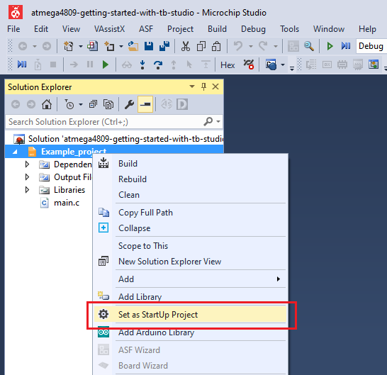

# Analog Signal Pulse Duration Measurement

This application shows an implementation of duration/frequency measurement for an analog input signal, with minimal usage of microcontroller power. It uses the Event System (EVSYS) to route the signals from the AC output through an Event Channel to Timer Counter B (TCB) Event Input. For this to happen, the Event System must be configured properly.

## Related Documentation
More details and code examples on the ATMEGA4809 can be found at the following links:
- [TB3211 - Getting Started with Analog Comparator (AC)](https://ww1.microchip.com/downloads/en/Appnotes/TB3211-Getting-Started-with-AC-90003211A.pdf)
- [ATMEGA4809 Product Page](https://www.microchip.com/wwwproducts/en/ATMEGA4809)
- [ATMEGA4809 Code Examples on GitHub](https://github.com/microchip-pic-avr-examples?q=atmega4809)
- [ATMEGA4809 Project Examples in START](https://start.atmel.com/#examples/ATMEGA4809XplainedPro)

## Software Used
- Microchip Studio 7.0.2542 or newer [(https://www.microchip.com/mplab/microchip-studio)](https://www.microchip.com/mplab/microchip-studio)
- ATmega_DFP 1.6.364 or newer Device Pack

## Hardware Used
- ATMEGA4809 Xplained Pro [(ATMEGA4809-XPRO)](https://www.microchip.com/developmenttools/ProductDetails/ATMEGA4809-XPRO)

## Setup
The ATMEGA4809 Xplained Pro Development Board is used as test platform.

 

The following configurations must be made for this project:

- CPU clock frequency is 3.33 MHz
- Configure PD2 as analog input and PA7 as digital output
- VREF
  - AC0 voltage reference at 1.5V
  - AC0 voltage reference enabled
- AC0
  - Positive input - pin 0
  - Negative input - DAC voltage reference is used for the negative input
  - DAC voltage reference is 0.8 V
  - AC0 enabled
  - AC0 output enabled
- TCB0
  - Input Capture Frequency and Pulse-Width measurement mode
  - Prescaler CLK_PER/2
  - Run Standby: enabled
- Event System
  - Analog Comparator 0 out linked to Event Channel 0
  - TCB uses Event Channel 0

 |Pin                       | Configuration       |
 | :---------------------:  | :----------------:  |
 |            PD2           |   AC input          |
 |            PA7           |   AC output         |

 ## Operation
 1. Connect the board to the PC.

 2. Open the **atmega4809-getting-started-with-ac-studio.atsln** solution in Microchip Studio.

 3. Set the **Analog_Signal_Pulse_Duration_Measurement** project as Start Up project. Right click on the project in the **Solution Explorer** tab and click **Set as StartUp Project**.

 

 4. Build the **Analog_Signal_Pulse_Duration_Measurement** project: right click on the **atmega4809-getting-started-with-ac-studio** solution and select **Build Solution**.

 

 5. Select the **ATMEGA4809 Xplained Pro** in the Connected Hardware Tool section of the project settings:
   - Right click on the project and click **Properties**;
   - Click on the **Tool** tab.
   - Select the ATMEGA4809 Xplained Pro (click on the **SN**) in the **Selected debugger/programmer** section, and Save (CTRL + S):

 

 6. Program the project to the board. Then, click on the **Debug** tab and click **Start Without Debugging**.

 

## Demo

The application will be able to measure the input signal pulse and period, and the AC will provide an output signal that switches when the input signal crosses the voltage reference.

To visualize the `signal_period` and `signal_pulse` variables values, the user needs to add the following instruction at the end of the `if` statement:

`   asm("NOP");`

Then, the user can enable a breakpoint on this line and visualize the signal period and the signal pulse inside the Variables window. Click on the **Debug** tab and click **Start Debugging and Break**.

 

 The image below presents the Analog Comparator output signal, for a square input signal. 
 

 The image below presents the resulting values when generating a 50% duty cycle square signal on the AC input.
 

 The values for a 20% duty cycle signal provided on the AC input and the values measured using the timer can be observed below.
 
 The input signal (green) and the output signal (yellow) are presented in the oscilloscope capture below.
 

 The values for a 80% duty cycle signal provided on the AC input the values measured using the timer are presented below.
 
 The input signal (green) and the output signal (yellow) are presented in the oscilloscope capture below.
 

 For a triangular input signal, the oscilloscope capture can be observed below.
 
 The voltage reference selected for the DAC (0.8V) on the negative input of the AC can be observed in the image below. The AC output goes high/low when the input voltage crosses ~0.8V.
 

## Summary

This project shows how to use the AC in conjunction with other peripherals such as VREF, DAC, EVSYS, TCB to measure the period and pulse width of an analog input signal.
