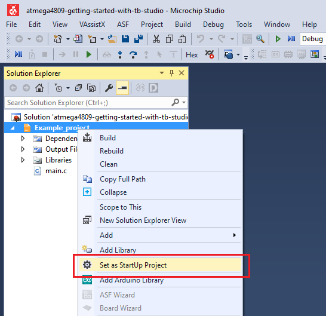
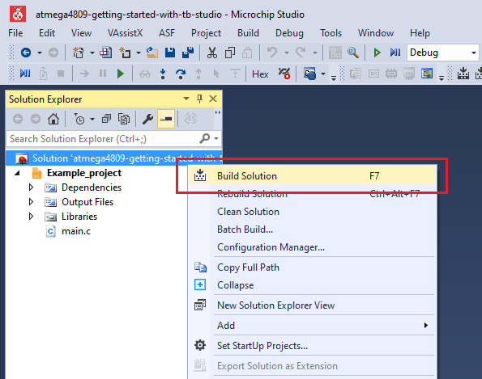
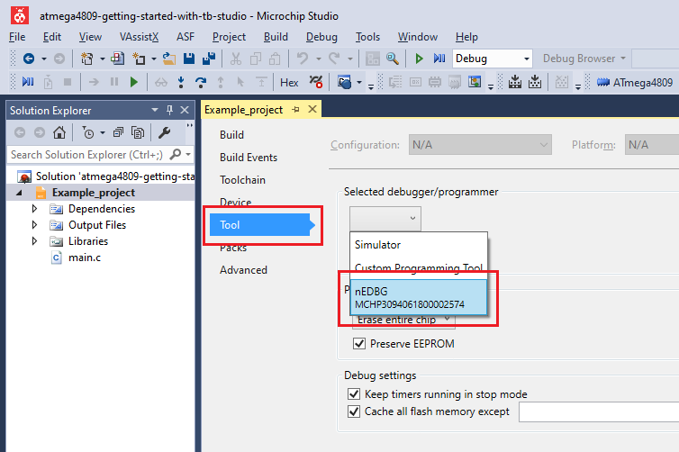
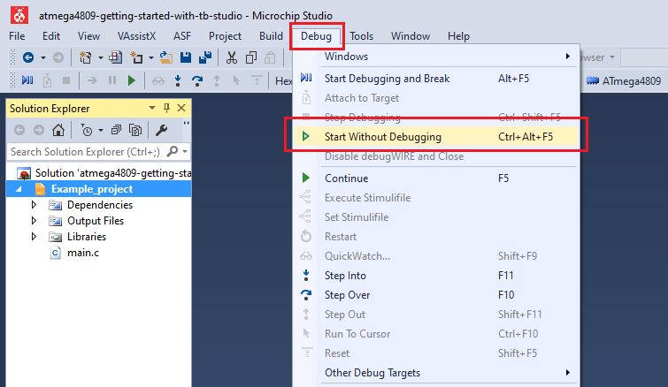
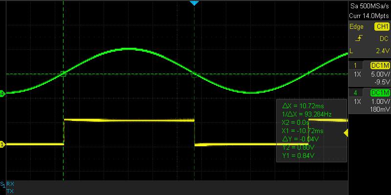
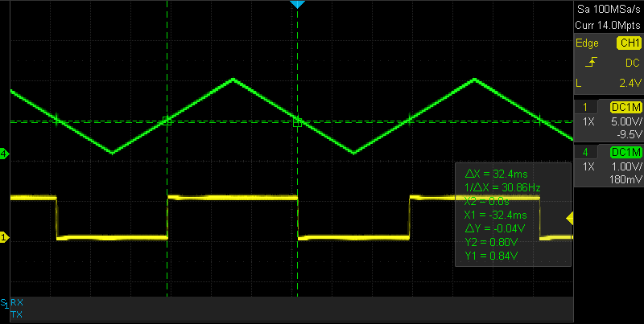
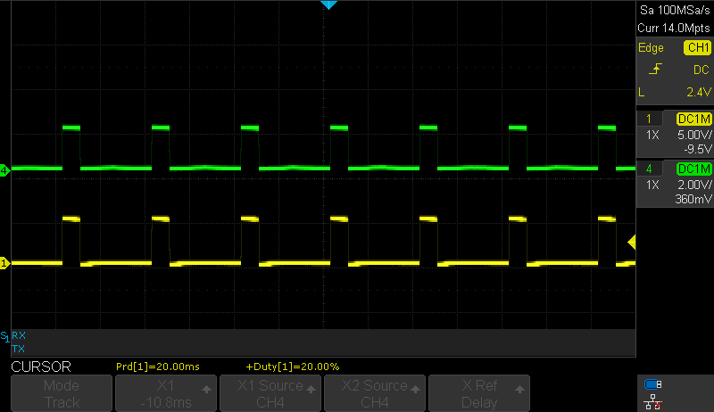
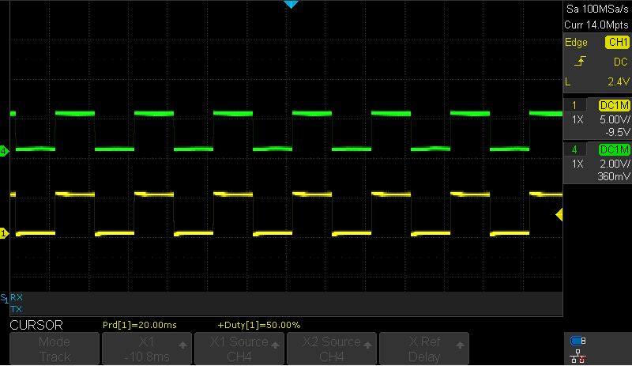
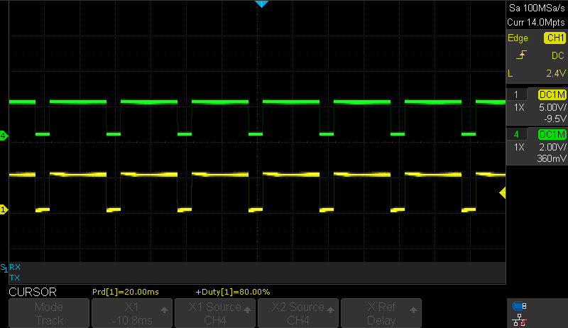

# Level Crossing Detector - Use Case for the ATmega4809 Microcontroller with Microchip Studio

This example shows a basic initialization and set up for the AC peripheral. The application monitors an analog input signal, compares it to a fixed voltage and notifies the user via interrupt and an output pin every time the input signal crosses the fixed voltage level.
The comparator can be used to monitor battery voltage (or any other DC level).

## Related Documentation
More details and code examples on the ATMEGA4809 can be found at the following links:
- [TB3211 - Getting Started with Analog Comparator (AC)](https://ww1.microchip.com/downloads/en/Appnotes/TB3211-Getting-Started-with-AC-DS90003211.pdf)
- [ATMEGA4809 Product Page](https://www.microchip.com/wwwproducts/en/ATMEGA4809)
- [ATMEGA4809 Code Examples on GitHub](https://github.com/microchip-pic-avr-examples?q=atmega4809)
- [ATMEGA4809 Project Examples in START](https://start.atmel.com/#examples/ATMEGA4809XplainedPro)

## Software Used
- Microchip Studio 7.0.2594 or newer [(https://www.microchip.com/mplab/microchip-studio)](https://www.microchip.com/mplab/microchip-studio)
- ATmega_DFP 2.1.506 or newer Device Pack

## Hardware Used
- ATMEGA4809 Xplained Pro [(ATMEGA4809-XPRO)](https://www.microchip.com/developmenttools/ProductDetails/ATMEGA4809-XPRO)

## Setup
The ATMEGA4809 Xplained Pro Development Board is used as test platform.

 

The following configurations must be made for this project:

- CPU clock frequency is 3.33 MHz
- Configure PD2 as analog input and PA7 as digital output
- VREF
  - AC0 voltage reference at 1.5V
  - AC0 voltage reference enabled
- AC0
  - Positive input - pin 0
  - Negative input - DAC voltage reference is used for the negative input
  - DAC voltage reference is 0.8 V
  - AC0 enabled
  - AC0 output enabled

 |Pin                       | Configuration      |
 | :---------------------:  | :----------------: |
 |            PA7           |   AC Output        |
 |            PD2           |   AC Input         |

 ## Operation
 1. Connect the board to the PC.

 2. Open the **atmega4809-getting-started-with-ac-studio.atsln** solution in Microchip Studio.

 3. Set the **Level_Crossing_Detector** project as Start Up project. Right click on the project in the **Solution Explorer** tab and click **Set as StartUp Project**.

 

 4. Build the **Level_Crossing_Detector** project: right click on the **atmega4809-getting-started-with-ac-studio** solution and select **Build Solution**.

 

 5. Select the **ATMEGA4809 Xplained Pro** in the Connected Hardware Tool section of the project settings:
   - Right click on the project and click **Properties**;
   - Click on the **Tool** tab.
   - Select the ATMEGA4809 Xplained Pro (click on the **SN**) in the **Selected debugger/programmer** section, and Save (CTRL + S):

 

 6. Program the project to the board: click on the **Debug** tab and click **Start Without Debugging**.

 

## Demo

In this demo, the AC output will go high (5V) when the input signal is above the threshold (0.8 V) and low (0V) when the input signal is below the threshold. In the following figures, the green signal is the input signal and the yellow signal is the output of the AC.

 Input: sine wave
 

 Input: triangle wave
 

 Input: square wave (20% duty cycle)
 

 Input: square wave (50% duty cycle)
 

 Input: square wave (80% duty cycle)
 

## Summary

This project shows a basic configuration for the AC peripheral. The application monitors an analog input signal and compares it to a fixed voltage. An interrupt is triggered and a pin is toggled every time the input signal crosses the fixed voltage level.
