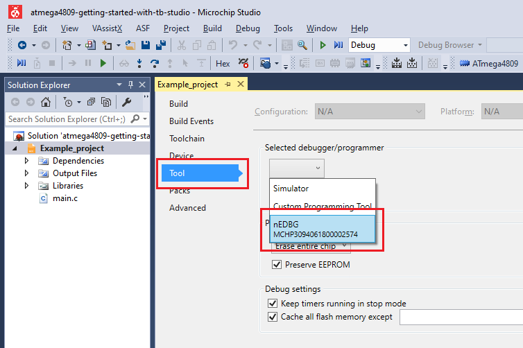
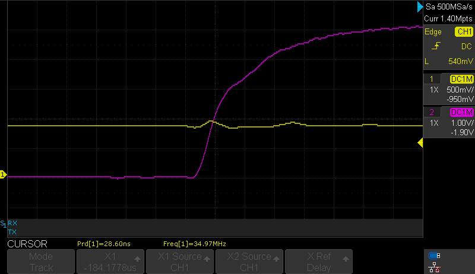

# Preventing False Spike Detection - Use Case for the ATmega4809 Microcontroller with Microchip Studio

This example demonstrates the hysteresis features of the AC module that helps in avoiding frequent
toggling of the AC when the positive input oscillates close to the negative input level.  
This application is based on the [Level Crossing Detector](../Level_Crossing_Detector) application and, additionally, it has the Hysteresis mode enabled.

## Related Documentation
More details and code examples on the ATmega4809 can be found at the following links:
- [TB3211 - Getting Started with Analog Comparator (AC)](https://ww1.microchip.com/downloads/en/Appnotes/TB3211-Getting-Started-with-AC-DS90003211.pdf)
- [ATmega4809 Product Page](https://www.microchip.com/wwwproducts/en/ATmega4809)
- [ATmega4809 Code Examples on GitHub](https://github.com/microchip-pic-avr-examples?q=atmega4809)
- [ATmega4809 Project Examples in START](https://start.atmel.com/#examples/ATmega4809XplainedPro)

## Software Used
- Microchip Studio 7.0.2594 or newer [(https://www.microchip.com/mplab/microchip-studio)](https://www.microchip.com/mplab/microchip-studio)
- ATmega_DFP 2.1.506 or newer Device Pack

## Hardware Used
- ATmega4809 Xplained Pro [(ATmega4809-XPRO)](https://www.microchip.com/developmenttools/ProductDetails/ATmega4809-XPRO)

## Setup
The ATmega4809 Xplained Pro Development Board is used as test platform.

 

The following configurations must be made for this project:

- CPU clock frequency is 3.33 MHz
- Configure PD2 as analog input and PA7 as digital output
- VREF
  - AC0 voltage reference at 1.5V
  - AC0 voltage reference enabled
- AC0
  - Positive input - pin 0
  - Negative input - DAC voltage reference is used for the negative input
  - DAC voltage reference is 0.8 V
  - Enable hysteresis at 25 mV
  - AC0 enabled
  - AC0 output enabled

 |Pin                       | Configuration       |
 | :---------------------:  | :----------------:  |
 |            PD2           |   AC input          |
 |            PA7           |   AC output         |

 ## Operation
 1. Connect the board to the PC.

 2. Open the **atmega4809-getting-started-with-ac-studio.atsln** solution in Microchip Studio.

 3. Set the **Preventing_False_Spike_Detection** project as Start Up project. Right click on the project in the **Solution Explorer** tab and click **Set as StartUp Project**.

 

 4. Build the **Preventing_False_Spike_Detection** project: right click on the **atmega4809-getting-started-with-ac-studio** solution and select **Build Solution**.

 

 5. Select the **ATmega4809 Xplained Pro** in the Connected Hardware Tool section of the project settings:
   - Right click on the project and click **Properties**;
   - Click on the **Tool** tab.
   - Select the ATmega4809 Xplained Pro (click on the **SN**) in the **Selected debugger/programmer** section, and Save (CTRL + S):

 

 6. Program the project to the board. Then, click on the **Debug** tab and click **Start Without Debugging**.

 

## Demo

This application shows the implementation of hysteresis in a voltage level detector application. 

The figure below presents both input (yellow) and the output (pink) signals of this application. There is no noticeable difference between the signals displayed here (with a 25 mV hysteresis enabled) and the signals provided for the basic Level Crossing Detector. In order to observe the differences, the user needs to zoom in to visualize the rising/falling edges of the signals.

 

A comparison between the without-hysteresis and with-hysteresis applications signals is presented below.

 The image below shows the AC configuration without the hysteresis activated, resulting in a spike on the output signal. When the input signal (yellow) oscillates around the threshold value of the AC, the output signal (pink) will switch more often than it should, generating spikes.
 

 The image below shows the AC configuration with the hysteresis activated, preventing the unwanted spikes on the output signal. Again, the input signal (yellow) oscillates around the threshold, but there are no spikes generated on the output (pink).
 

## Summary

This project shows how to use the hysteresis when building a voltage level detector application using the AC.
